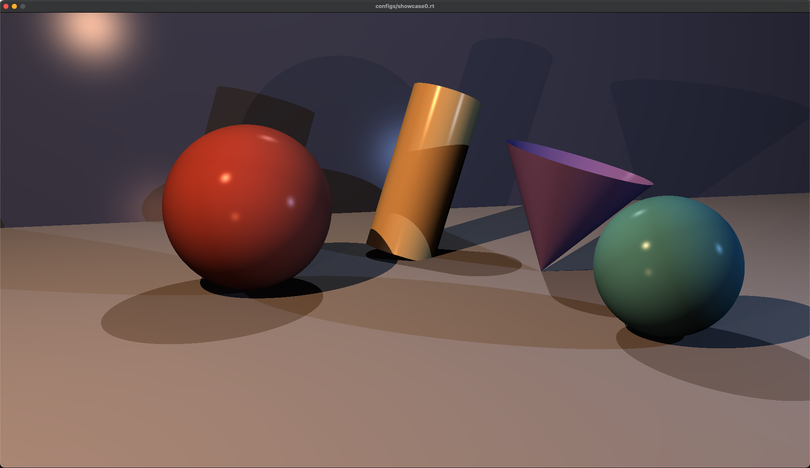
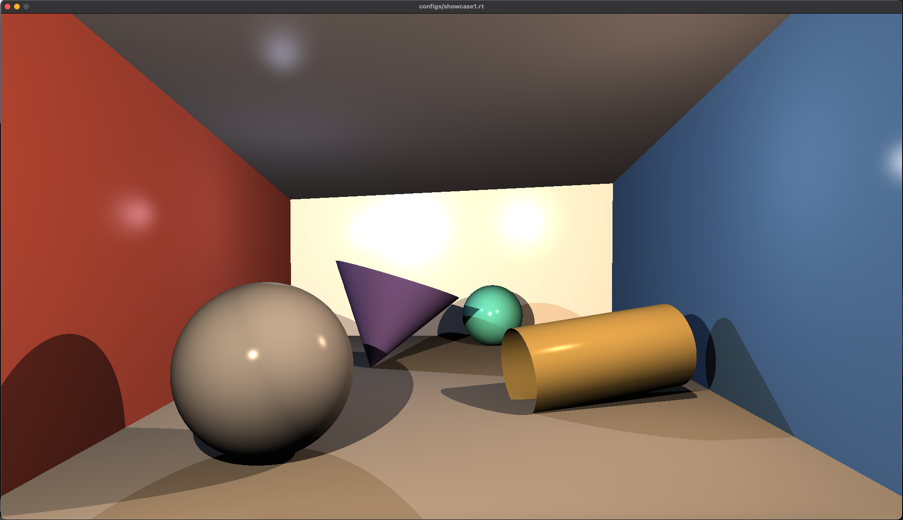
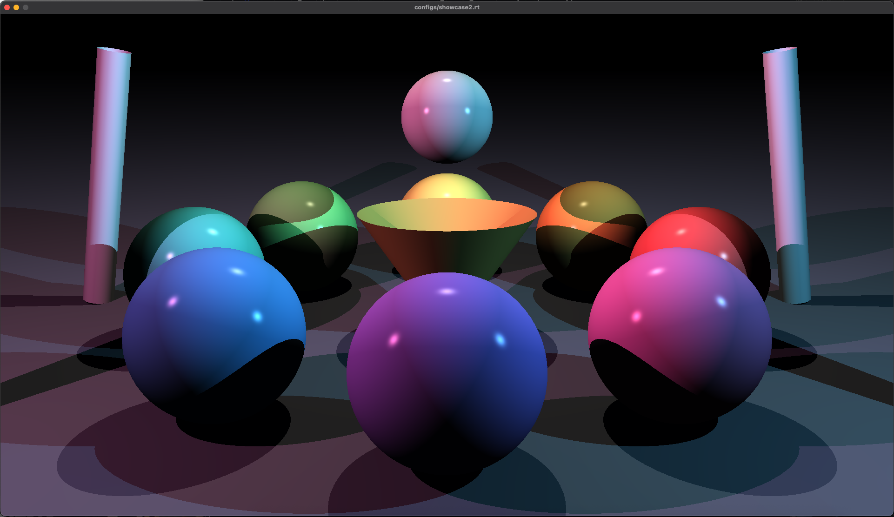
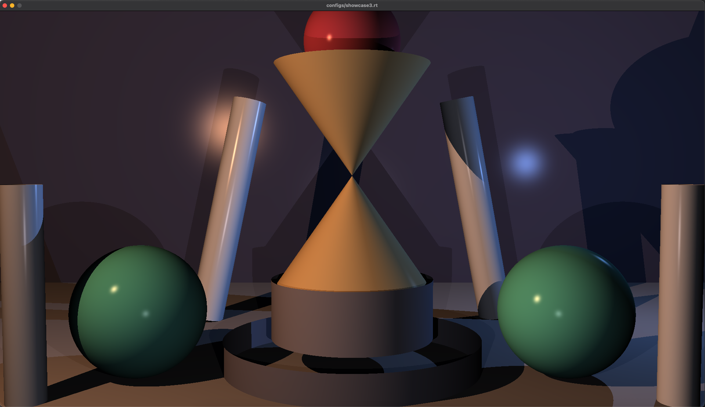
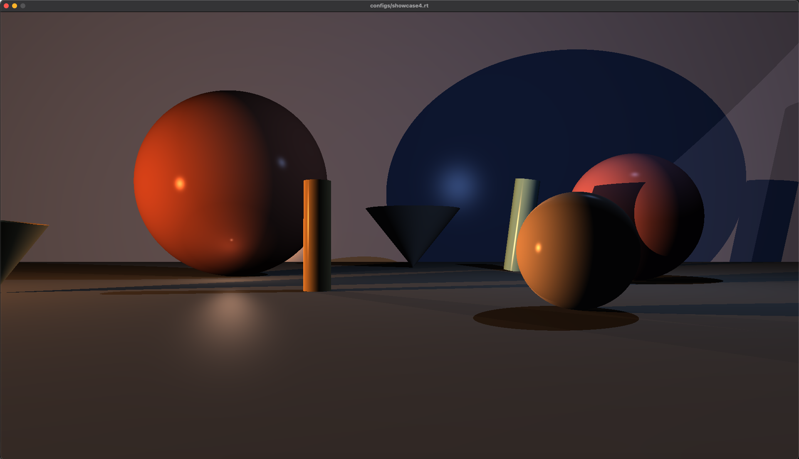
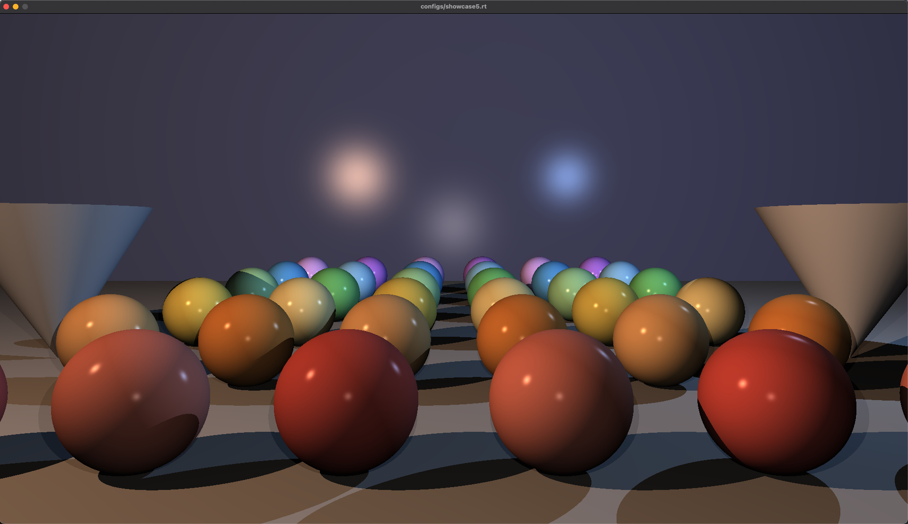
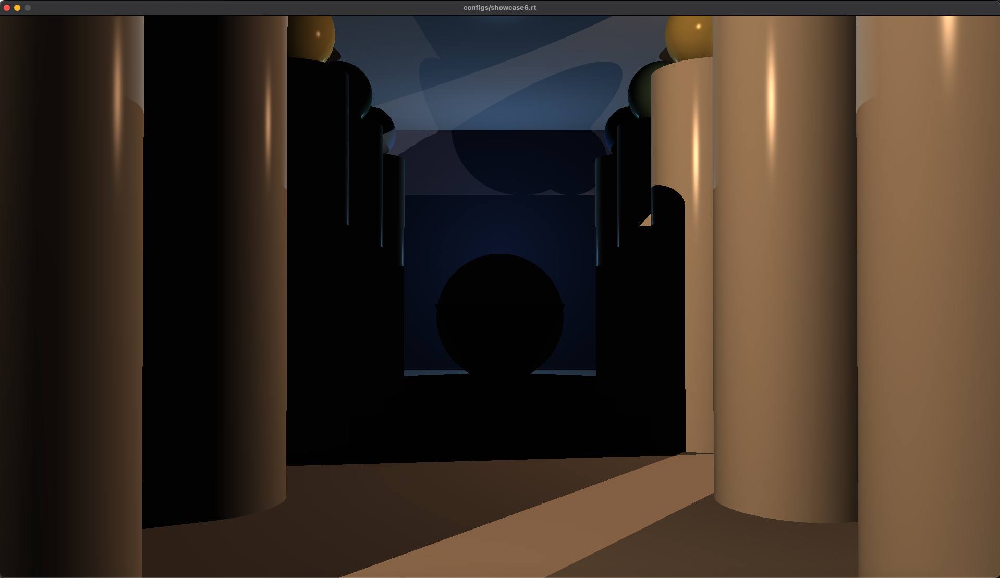
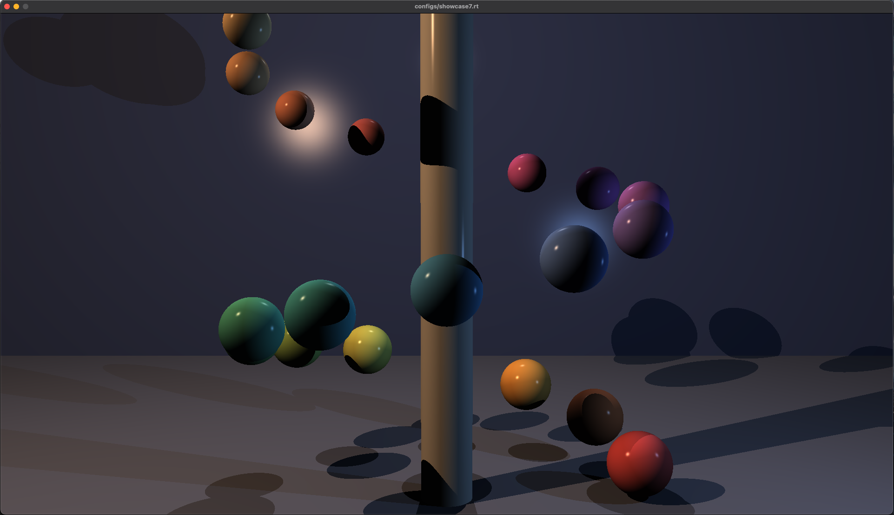
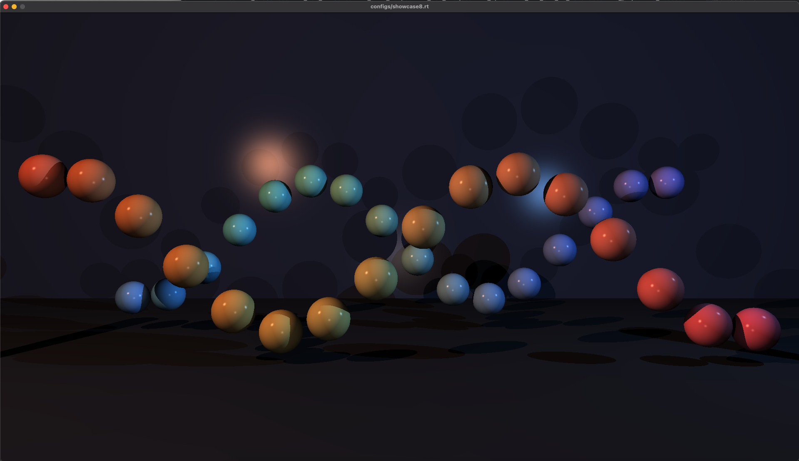

*This project has been created as part of the 42 curriculum by weizhang, jsun.*

# miniRT

# Description

A small ray tracer written in C with MiniLibX. It reads a scene description file (`*.rt`), renders it with the Phong reflection model and displays the result in a window.

---

# Showcase

All images below are rendered by this program from the scene files in `configs/`.

### `configs/showcase0.rt` — the basics

Sphere, cylinder, cone and two planes under four colored lights.



### `configs/showcase1.rt` — a closed room

Five planes forming a box. Shows how colored lights bounce their tint onto the walls and how objects shadow each other.



### `configs/showcase2.rt` — color wheel

Nine spheres in a ring around a cone, lit by a pink and a cyan spot. Overlapping shadows from multiple lights.



### `configs/showcase3.rt` — hourglass

Stacked cylinders and two cones, plus tilted pillars. Tests the object transforms: scaling, rotation and translation all come from the scene file.



### `configs/showcase4.rt` — large scale

Very large spheres and a wide FOV camera.



### `configs/showcase5.rt` — sphere grid

36 spheres in a rainbow grid. A stress test for the number of shapes in a scene.



### `configs/showcase6.rt` — colonnade

Ten cylinders with spheres on top inside a corridor.



### `configs/showcase7.rt` — helix

24 spheres of decreasing size spiralling around a central cylinder.



### `configs/showcase8.rt` — waves

Two sine waves of spheres in a dark scene.



---

# Instructions

### Build

```sh
make          # builds ./miniRT
make bonus    # same build
make clean    # removes objects
make fclean   # also removes the binary
make re
```

### Run

```sh
./miniRT configs/showcase0.rt
```

The program takes exactly one argument, a file whose name ends in `.rt`. Press `ESC` or click the close button to quit.

### Scene file format

One element per line, fields separated by one or more spaces, elements in any
order.

| Id   | Element  | Format                                                             |
| ---- | -------- | ------------------------------------------------------------------ |
| `A`  | Ambient  | `A <ratio [0,1]> <R,G,B>`                                          |
| `C`  | Camera   | `C <x,y,z> <nx,ny,nz [-1,1]> <FOV [0,180]>`                        |
| `L`  | Light    | `L <x,y,z> <brightness [0,1]> <R,G,B>`                             |
| `sp` | Sphere   | `sp <x,y,z> <diameter> <R,G,B>`                                    |
| `pl` | Plane    | `pl <x,y,z> <nx,ny,nz> <R,G,B>`                                    |
| `cy` | Cylinder | `cy <x,y,z> <nx,ny,nz> <diameter> <height> <R,G,B>`                |
| `cn` | Cone     | `cn <x,y,z> <nx,ny,nz> <diameter> <height> <R,G,B>`                |

Minimal single-object scenes are available in `configs/sphere.rt`,
`configs/plane.rt`, `configs/cyl.rt` and `configs/cone.rt`.

Any malformed line makes the parser fail; the program exits with an error
message instead of rendering.

---

# Resources

- Jamis Buck, *The Ray Tracer Challenge* — the book this implementation follows
  for the ray/shape intersection math, the view transform and the Phong
  lighting model.

### Use of AI

- To draft this README
- To generate all files in `configs/`
- To refactor the code when it is repetitive (norminette)
